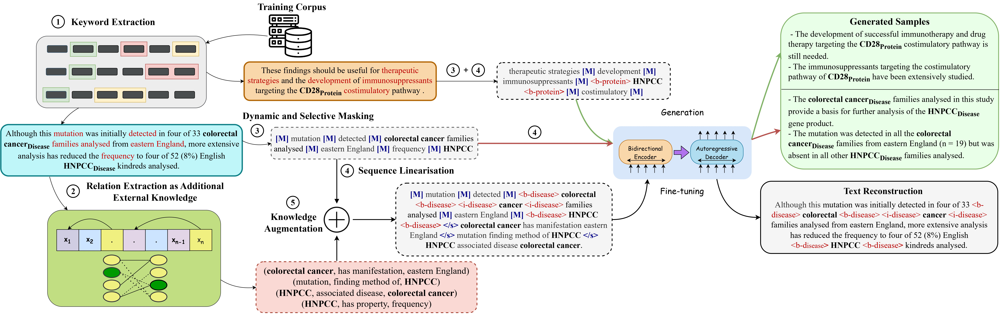

# BioAug
Implementation of [BioAug: Conditional Generation based Data Augmentation for Low-Resource Biomedical NER](https://arxiv.org/abs/2305.10647)



### Steps to generating data augmentations from BioAug

* Installing dependencies using:
```
pip install -r requirements.txt
```

* Identify keywords and prepare your dataset in the format given in [sample-dataset](./sample-dataset/)

```
        Word \tabspace Label \tabspace Word Class (NOUN, PRONOUN, ...) \tabspace IsKeyword? (use BIO tagging scheme)
```

* Setup [OpenNRE](https://github.com/thunlp/OpenNRE) and download the checkpoint [here](https://drive.google.com/file/d/1crS7O0FZvBWTF_XZNba3Kt2nVxHao8po/view?usp=sharing). If you want to train your own OpenNRE model, follow the steps below:
    * Prepare a dataset using [this GitHub link](https://github.com/IBM/aihn-ucsd/tree/master/amil) or any other relation extraction (RE) dataset. You would need to follow Step 1 and Step 2. For Step 1, you can use the dataset [here](https://drive.google.com/file/d/1toip1QMx4FkYBqk6fgXnZllTjIjbP1RO/view?usp=sharing)
    * OpenNRE does not support pretraining random models. We had to update their code. Check [pretrain.py](./assets/pretrain.py).

* Use [preprocess.py](preprocess.py) to convert the data into the correct format and also precompute the relations between entities. (Do update lines 75, 99 and 118 according to your dataset)

* Run [train_dynamic.sh](./script/train_dynamic.sh) to train your model using the following command:
  ```
  sh train_dynamic.sh <size> <dataset> <flair_batch_size> <SEED> <generations> <shouldLinearizeAllWords>
  ```
  Example:
  ```
  sh train_dynamic.sh 500 ebmnlp 8 42 5 1
  ```
  The above step will train and generate data augmentations using BioAug followed by training a NER model on gold + augmentations using [flair](https://github.com/flairNLP/flair)

### Note: You'll need to update dataset paths in the scripts according to your own setting.
---
**Please cite our work:**
```
@misc{ghosh2023bioaug,
      title={BioAug: Conditional Generation based Data Augmentation for Low-Resource Biomedical NER},
      author={Sreyan Ghosh and Utkarsh Tyagi and Sonal Kumar and Dinesh Manocha},
      year={2023},
      eprint={2305.10647},
      archivePrefix={arXiv},
      primaryClass={cs.CL}
}
```
